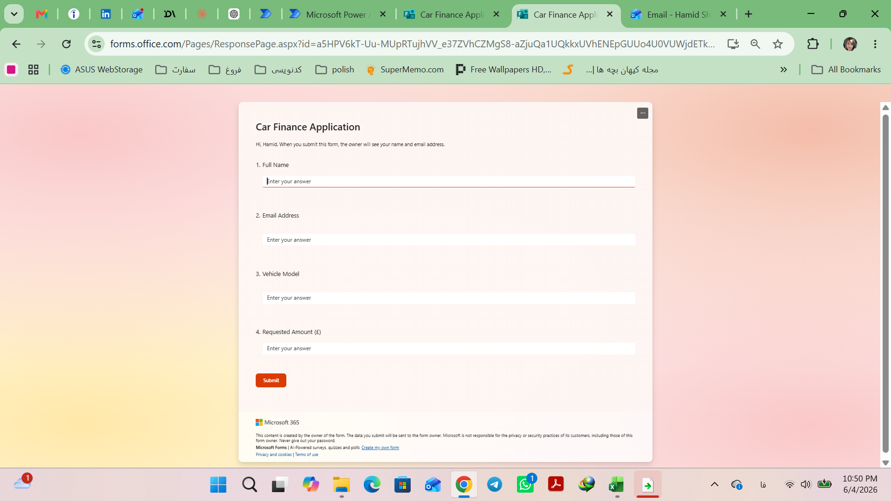
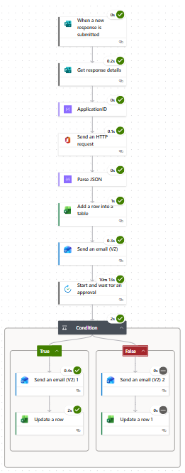
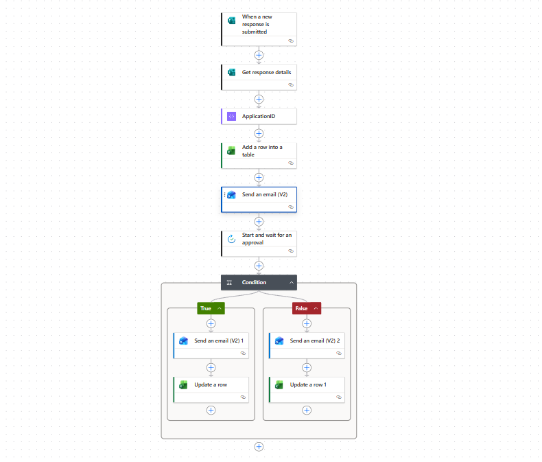
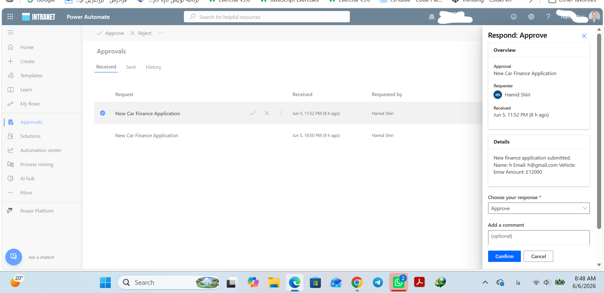
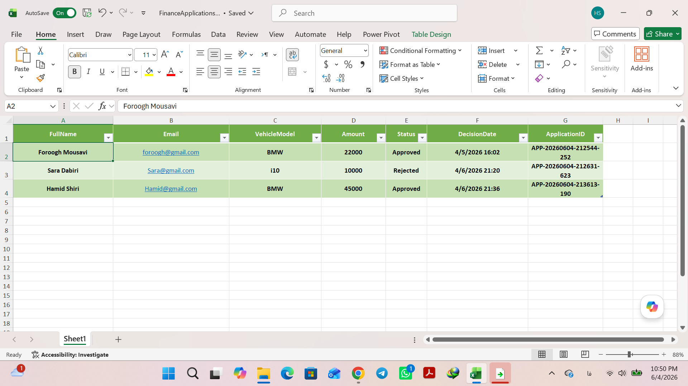
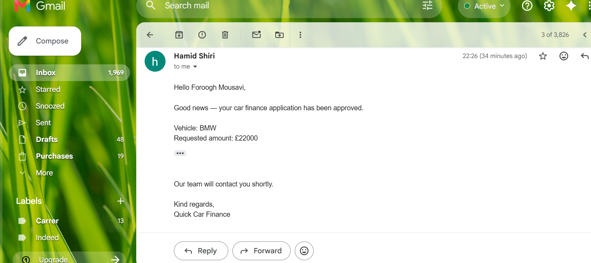
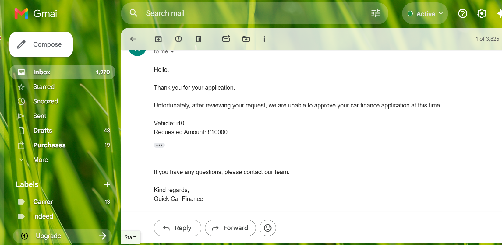
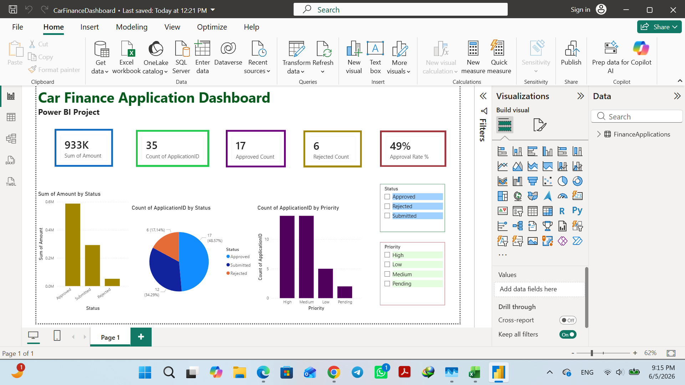

# Car Finance Approval Workflow

## Overview

This project demonstrates a complete end-to-end business process automation solution built using Microsoft Power Platform.

The workflow automates the car finance application process from application submission through approval, decision tracking, email notifications, API enrichment, and business reporting.

The solution integrates Microsoft Forms, Power Automate, Microsoft Graph API, Excel Online, Outlook, Approval Actions, and Power BI into a single automated business process.

---

## Business Problem

Many finance application processes rely on manual steps that can result in:

- Repetitive data entry
- Approval delays
- Email back-and-forth communication
- Poor application visibility
- Inconsistent decision tracking
- Limited reporting capabilities

This project addresses these challenges through workflow automation and centralized tracking.

---

## Solution Architecture

The workflow performs the following steps:

1. Applicant submits a finance application through Microsoft Forms.
2. Power Automate retrieves application details.
3. A unique Application ID is generated automatically.
4. Microsoft Graph API retrieves user profile information.
5. Application data is stored in Excel Online.
6. An approval request is generated automatically.
7. Reviewer approves or rejects the application.
8. Excel records are updated automatically.
9. Applicant receives an automated decision email.
10. Power BI dashboards provide reporting and analytics.

---

## Process Flow

```text
Microsoft Form
       ↓
Get Response Details
       ↓
Generate Application ID
       ↓
Microsoft Graph API
       ↓
Parse JSON Response
       ↓
Store in Excel
       ↓
Approval Request
       ↓
Approve / Reject
       ↓
Update Excel Status
       ↓
Send Notification Email
       ↓
Power BI Dashboard
```

---

## Technologies Used

| Technology | Purpose |
|------------|----------|
| Microsoft Forms | Application collection |
| Power Automate | Workflow automation |
| Microsoft Graph API | User information retrieval |
| HTTP Requests | API communication |
| JSON Parsing | API response processing |
| Excel Online | Application database |
| Outlook | Email notifications |
| Approval Actions | Approval management |
| Power BI | Reporting and analytics |

---

## Workflow Features

### Automated Application Intake

Applications are collected through a structured Microsoft Form and processed automatically.

### Unique Application ID Generation

Every application receives a unique identifier.

Example:

```text
APP-20260605-145453
```

### Microsoft Graph API Integration

The workflow automatically retrieves:

- User display name
- Given name
- Surname
- Email address
- Job title
- Office location

This information is automatically stored alongside application records.

### Automated Approval Process

Applications are routed automatically to reviewers without manual intervention.

### Approval and Rejection Handling

The workflow supports:

- Approval
- Rejection

with automatic status updates.

### Automated Email Notifications

Applicants receive automated notifications after a decision has been made.

### Excel-Based Tracking

All applications are stored in a centralized Excel Online database.

### Power BI Reporting

Interactive dashboards provide visibility into:

- Total applications
- Approval rates
- Rejection rates
- Requested finance amounts
- Priority levels
- Application trends

---

## Screenshots

### Application Form



Applicant-facing form used to submit finance applications.

---

### Workflow Overview



Complete workflow showing business process automation.

---

### Power Automate Flow



Implementation of the workflow in Microsoft Power Automate.

---

### Approval Request



Approval request generated automatically for decision makers.

---

### Excel Application Database



Centralized storage of submitted applications.

---

### Excel Results After Processing


Application records enriched with API data and workflow results.

---

### Approval Notification



Automatic email sent after approval.

---

### Rejection Notification



Automatic email sent after rejection.

---

### Power BI Dashboard



Interactive dashboard providing business insights and reporting.

---

## Key Skills Demonstrated

- Business Process Automation
- Microsoft Power Automate
- Microsoft Forms Integration
- Microsoft Graph API
- REST API Integration
- HTTP Requests
- JSON Parsing
- Data Enrichment
- Excel Online Integration
- Outlook Automation
- Approval Workflows
- Process Design
- Workflow Development
- Data Tracking
- Power BI Reporting
- Business Intelligence
- Low-Code Development

---

## Business Benefits

- Reduced manual processing
- Faster approval decisions
- Improved visibility
- Centralized data storage
- Automated notifications
- Improved reporting capabilities
- Reduced administrative effort
- Scalable workflow design

---

## Potential Enhancements

Future versions may include:

- Multi-level approvals
- AI-assisted application assessment
- Risk scoring engine
- Automated fraud detection
- Dataverse integration
- SharePoint integration
- Applicant self-service portal
- Advanced Power BI analytics
- AI-generated decision summaries

---

## Author

**Forough Moosavi**

Data Analyst | Business Intelligence | Process Automation

LinkedIn:

https://www.linkedin.com/in/forough-s-moosavi

---

## License

This project is provided for educational, demonstration, and portfolio purposes.

---

## Repository Purpose

This repository demonstrates practical experience in:

- Process Automation
- Workflow Development
- API Integration
- Business Intelligence
- Power Platform Solutions

and serves as a portfolio project showcasing real-world business automation using Microsoft technologies.
