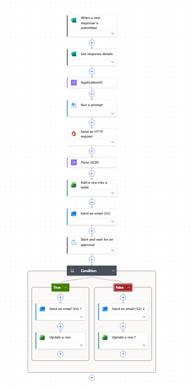
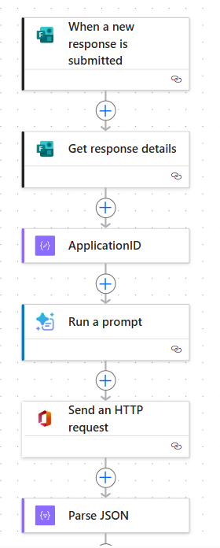
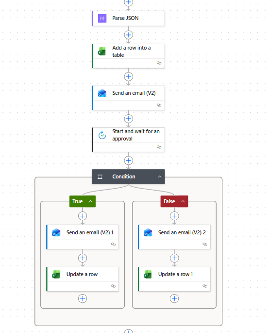
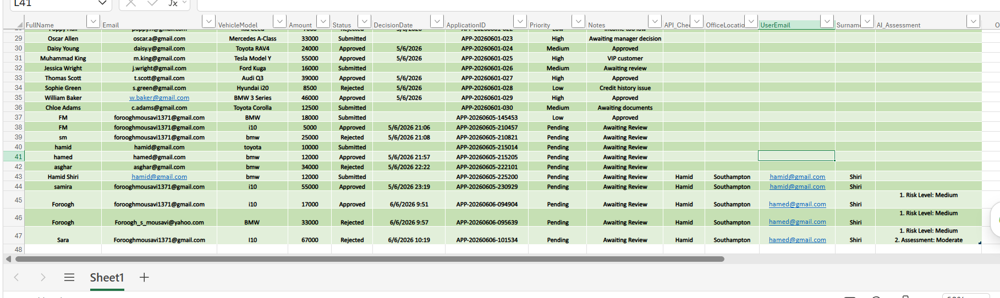

# Car Finance Approval Workflow

## Overview

This project demonstrates a complete end-to-end business process automation solution built using Microsoft Power Platform.

The workflow automates the car finance application process from submission through approval, decision notification, Excel tracking, API enrichment, AI assessment, and Power BI reporting.

The solution integrates Microsoft Forms, Power Automate, Microsoft Graph API, AI-powered assessment, Excel Online, Outlook, Approval Actions, and Power BI into a single automated business workflow.

---

## Business Problem

Manual finance application processing often involves:

* Repetitive data entry
* Approval delays
* Email back-and-forth communication
* Limited visibility into application status
* Inconsistent tracking
* Difficult reporting and analytics

This project addresses these challenges by automating the entire approval lifecycle.

---

## Solution Architecture

```text
Microsoft Forms
       ↓
Get Response Details
       ↓
Generate Application ID
       ↓
Microsoft Graph API
       ↓
Parse JSON Response
       ↓
AI Assessment
       ↓
Store Data in Excel Online
       ↓
Manager Approval Request
       ↓
Approve / Reject Decision
       ↓
Update Excel Status
       ↓
Applicant Notification Email
       ↓
Power BI Dashboard
```

---

## Technologies Used

| Technology          | Purpose                 |
| ------------------- | ----------------------- |
| Microsoft Forms     | Application collection  |
| Power Automate      | Workflow automation     |
| Microsoft Graph API | API integration         |
| HTTP Requests       | API communication       |
| Parse JSON          | Response processing     |
| GPT-4.1 Mini        | AI-powered assessment   |
| Excel Online        | Application database    |
| Outlook             | Email notifications     |
| Approval Actions    | Decision management     |
| Power BI            | Reporting and analytics |

---

## Workflow Features

### Automated Application Intake

Applications are collected through Microsoft Forms and processed automatically.

### Unique Application ID Generation

Every submission receives a unique identifier.

Example:

```text
APP-20260605-145453
```

### Microsoft Graph API Integration

The workflow demonstrates Microsoft Graph API integration through HTTP requests and JSON response processing.

The API response is parsed automatically using the Parse JSON action and stored within the workflow for further processing.

This demonstrates practical experience with:

* REST API Integration
* HTTP Requests
* JSON Processing
* Data Enrichment Workflows
* Microsoft 365 Integration

### AI-Assisted Assessment

The workflow uses GPT-4.1 Mini to analyse finance applications and generate an AI assessment before human review.

The AI evaluates submitted application information, including:

* Applicant details
* Vehicle information
* Requested finance amount

The generated assessment is automatically stored in Excel and can be used to support decision-making during the approval process.

### Automated Approval Process

Applications are routed automatically to reviewers.

### Approval & Rejection Handling

The workflow supports both approval and rejection paths with automatic updates.

### Email Notifications

Applicants receive automated emails once a decision is made.

### Excel Tracking

All applications are stored and updated automatically.

### Power BI Reporting

Business dashboards provide real-time visibility into application activity.

---

# Process Walkthrough

## Step 1 — Finance Application Form

Applicants submit their finance requests using Microsoft Forms.


---

## Step 2 — Power Automate Workflow

The workflow retrieves form responses, generates Application IDs, enriches data through Microsoft Graph API, performs AI assessment, and stores records in Excel.






---

## Step 3 — Enriched Application Records

The workflow enriches application data using Microsoft Graph API, generates AI assessments, and updates records automatically.



---

## Step 4 — Approval Workflow

The application is automatically routed to a reviewer for approval or rejection.


---

## Step 5 — Manager Approval Request

The reviewer receives an approval request containing the application details.


---

## Step 6 — Applicant Approval Notification

If approved, the applicant receives an automatic approval email.


---

## Step 7 — Applicant Rejection Notification

If rejected, the applicant receives an automatic rejection email.


---

## Step 8 — Power BI Dashboard

Business users can monitor applications, approval rates, rejection rates, and trends through Power BI.


---

## Skills Demonstrated

* Business Process Automation
* Microsoft Power Automate
* Microsoft Forms Integration
* Microsoft Graph API
* REST API Integration
* HTTP Requests
* JSON Parsing
* Excel Online Integration
* Outlook Automation
* Approval Workflows
* Conditional Logic
* Data Tracking
* Power BI Reporting
* Business Intelligence
* Low-Code Development
* AI Integration
* Prompt Engineering
* Generative AI

---

## Business Benefits

* Reduced manual effort
* Faster approval processing
* Automated communication
* Centralized application tracking
* Improved reporting visibility
* Scalable business workflow

---

## Future Enhancements

Potential future improvements include:

* Multi-level approvals
* Risk scoring engine
* Dataverse integration
* SharePoint integration
* Automated fraud detection
* Applicant self-service portal
* Advanced Power BI analytics
* Python-based reporting automation

---

## Author

**Forough Moosavi**

Data Analyst | Business Intelligence | Process Automation

LinkedIn:

https://www.linkedin.com/in/forough-s-moosavi

---

## License

This project is provided for educational, demonstration, and portfolio purposes.
